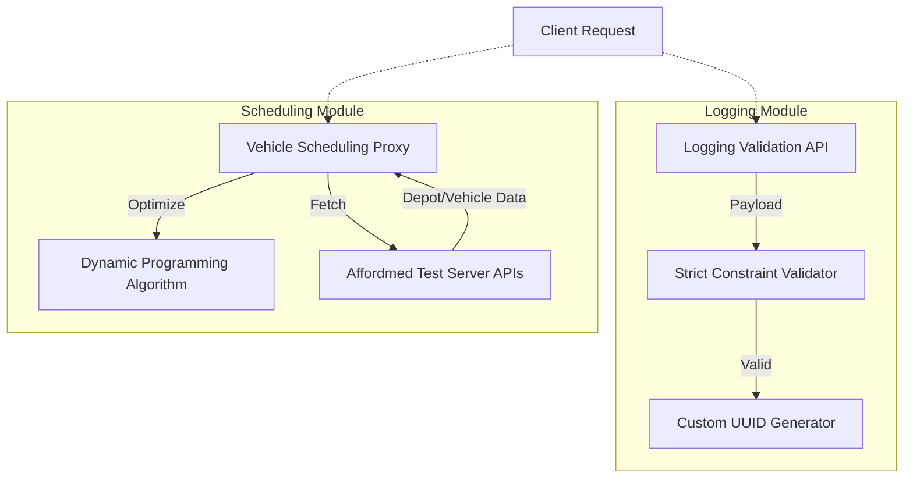
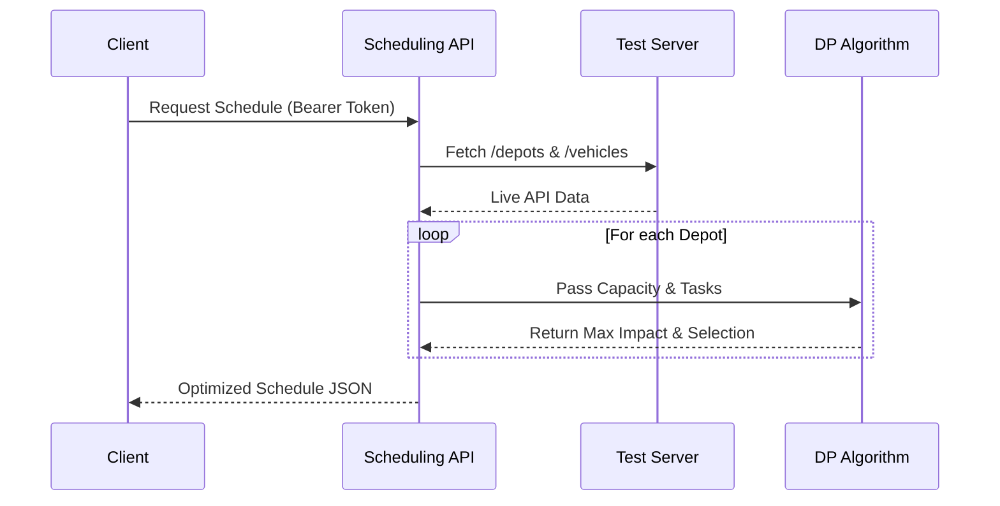

# Backend Engineering Assessment

This repository contains my solutions for the core backend engineering challenges. The systems are designed with a focus on clean architecture, readable code, and scalable design principles. All solutions adhere to the strict constraint of implementing custom logic and algorithms from scratch without relying on external algorithmic libraries.

## Project Architecture

The repository is modularized into independent backend services. The following diagram illustrates the high-level architecture and responsibilities of the implemented modules:

## Implemented Modules

### 1. Logging Validation Middleware
A custom Express API endpoint designed to intercept incoming application logs. 
- It strictly validates the payload against a predefined set of constraints, ensuring that packages align correctly with their respective stacks.
- It includes a custom-built, zero-dependency UUID generation algorithm to handle unique log identification.

### 2. Vehicle Scheduling Microservice
An advanced microservice that acts as an optimization proxy.
- It fetches live depot and vehicle data from an external Test Server.
- It utilizes a custom Dynamic Programming algorithm to solve the 0/1 Knapsack Problem, maximizing the operational impact score of vehicle tasks within a strict mechanic-hour budget constraint.

### 3. Notification System Design & App
- **System Design:** The repository contains a comprehensive system design document detailing a decoupled, scalable notification service architecture.
- **Implementation:** The associated backend application manages the queuing and dispatching logic for the notification service.

## Data Flow Diagram: Scheduling Optimization

The following flowchart outlines the specific execution path for the dynamic programming optimization module:

## Technology Stack

- **Runtime:** Node.js
- **Framework:** Express.js
- **Design Pattern:** Modular MVC architecture for separation of concerns.
- **Algorithms:** Pure JavaScript implementations (Dynamic Programming, custom UUID generation) to adhere to the zero-dependency rule.

Note: As per the challenge guidelines, external utility libraries such as lodash, moment.js, or uuid were strictly avoided for core algorithms to demonstrate raw coding competency.

## Testing & Verification

The APIs were rigorously tested to ensure performance and correctness. Screenshots capturing the request bodies, response payloads, and execution times are provided as part of the submission to verify the successful integration and output formatting required by the problem statements.
