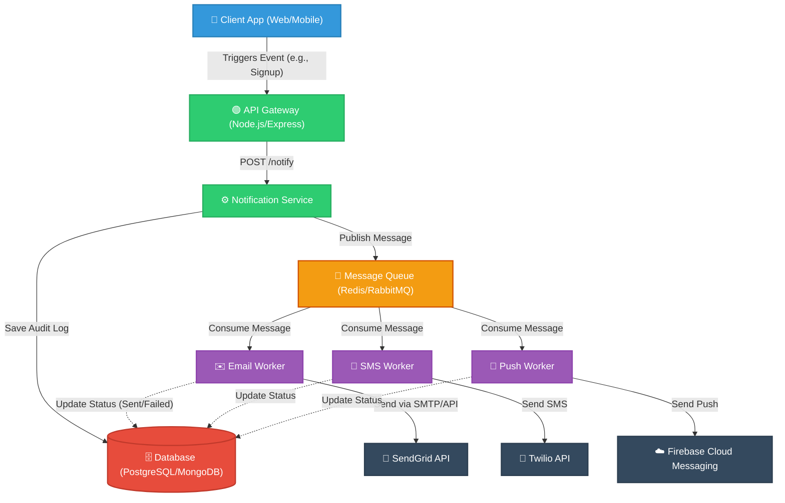
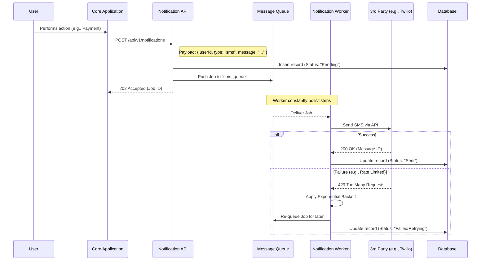

# Scalable Notification System Design

This document outlines the architecture and data flow for our scalable notification backend. The goal is to design a system that can reliably send emails, SMS, and push notifications to users without blocking the main application thread or losing messages during high traffic spikes.

## 🏗️ High-Level Architecture

I've chosen an event-driven, microservices-oriented approach. By decoupling the core business logic from the notification delivery mechanism, we ensure that the system remains responsive even if a third-party provider (like SendGrid or Twilio) experiences downtime.

### Component Breakdown

1.  **API Gateway & Notification Service:** This Node.js/Express application receives requests from client applications or other internal microservices. It validates the payload, logs the initial intent to the database, and pushes the job to a queue. It returns a `202 Accepted` response immediately.
2.  **Message Queue:** The backbone of our asynchronous processing. Using Redis (via BullMQ) or RabbitMQ ensures that sudden bursts of notification requests are buffered and processed at a steady rate.
3.  **Workers:** Independent Node.js processes that subscribe to specific queue channels (e.g., `email_queue`, `sms_queue`). They handle the actual network calls to external providers. If a call fails due to a network blip, the worker can automatically retry the job with exponential backoff.
4.  **Database:** Stores user preferences (e.g., "opt-out of marketing SMS") and an audit trail of every notification attempt for analytics and debugging.

## 🔄 Data Flow Diagram

Here is a sequence diagram detailing the lifecycle of a single notification request.

## 🧠 Key Architectural Decisions

*   **Why a Message Queue?** If we attempt to send emails synchronously within the HTTP request cycle, a slow response from SendGrid would cause our API to hang, leading to poor user experience and potential timeouts. The queue acts as a shock absorber.
*   **Idempotency:** The worker processes are designed to be idempotent. If a worker crashes right after sending an email but before updating the database, the queue might re-deliver the job. The system should check the database to see if a notification with that specific `jobId` was already marked as "Sent" before attempting delivery again.
*   **Rate Limiting & Retries:** External providers strictly rate-limit API calls. The workers gracefully handle `429 Too Many Requests` responses by placing the job back in the queue with a delay, ensuring we don't drop messages.
